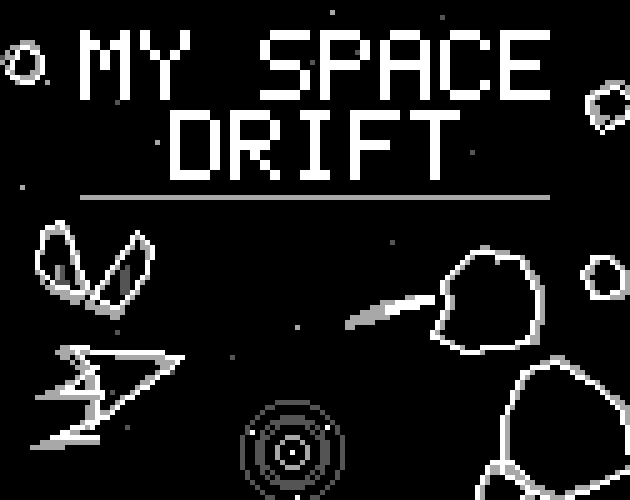
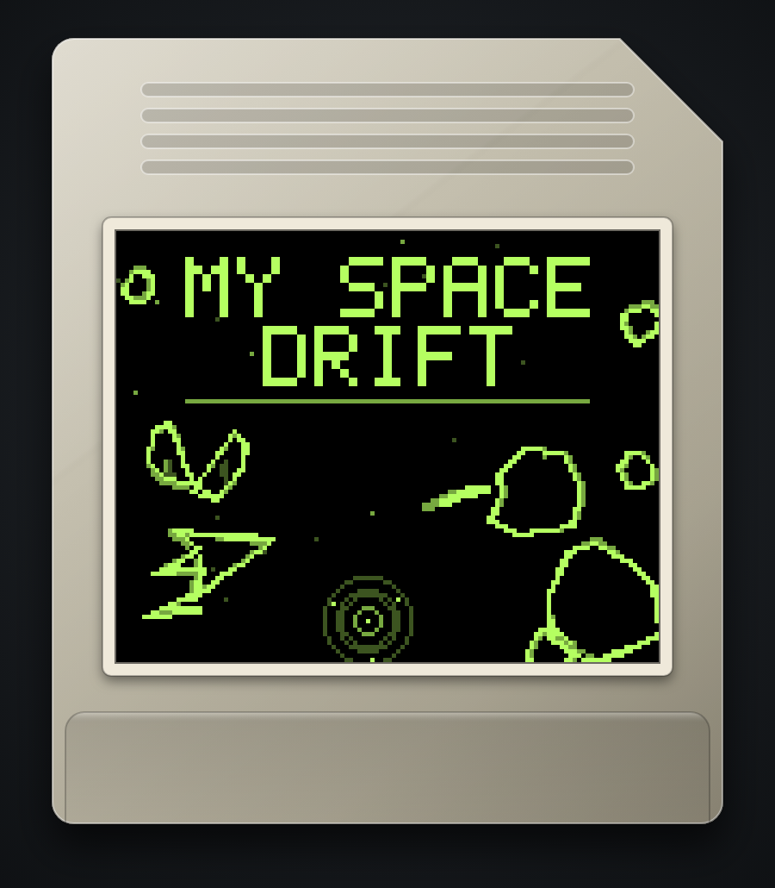

# My Space Drift

Juego web (PWA) jugable desde el navegador.

**Jugar:** https://elpatopotato.github.io/myspacedrift/


*La juega el bot de la demo: el GIF sale de `dev/capture-media.mjs`, que graba
una partida de verdad.*

- `index.html` — juego completo (canvas + JS)
- `sw.js` — service worker, cache-first (funciona offline tras la primera carga)
- `manifest.webmanifest` — instalable como app
- `icon-*.png` — iconos de la app, generados por `tools/make-icons.py`
- `.nojekyll` — evita que GitHub Pages procese el sitio con Jekyll

## Controles

Hacen falta dos dispositivos: la partida se abre en una pantalla grande (TV,
portátil) y el móvil hace de mando. La pantalla grande muestra un código de
seis dígitos; en el móvil se abre la misma URL con `?ctrl` y se escribe ahí
ese código.

No hace falta que estén en la misma red: sirve wifi, ethernet o datos
móviles, con que los dos tengan internet. El enlace intenta primero la vía
directa y, si el NAT no la deja pasar, sale por un servidor TURN de relevo.

El código de la pantalla no cambia al recargar: queda guardado, así que el
móvil se reconecta solo cuando la tele vuelve.

La dirección se parte en dos renglones cuando no entra de uno. Con el rótulo
delante mide 281 puntos y el LCD no pasa de `CFG.lcdCols`, así que se cortaba
por los dos lados justo el renglón que hay que teclear en el móvil. El corte va
en la primera `/`: el dominio arriba y el resto abajo, que es donde la vista ya
corta sola.

Partirla hace crecer el bloque, y en las pantallas que caen al piso de filas el
alto no sobra, así que `drawMenu` reparte cediendo por utilidad: primero se cae
la ayuda de navegación (repite lo que dice la franja de abajo), después el
tamaño del título (es adorno) y solo al final el del código. La dirección no se
corta nunca y el código no se saca nunca: sin esos dos no hay con qué emparejar
el móvil, que es lo único que esa pantalla tiene que resolver.

Ya en el mando, se toca:

- Lado izquierdo — propulsor izquierdo
- Lado derecho — propulsor derecho
- Ambos lados — freno

## Demo

El menú tiene tres opciones: `PLAY`, `DEMO` y `HIGH SCORES`. `DEMO` es para
mirar: la máquina juega una partida de verdad y el juego se explica solo
mientras ella vuela, así que sirve para enseñárselo a alguien sin tener que
narrarlo.

Se ve la partida entera —marcador, nivel, sonido y campo a plena luz— y encima
dos cosas que no están al jugar:

- La franja de abajo, la misma que muestra los controles en el menú, se
  **enciende** con el propulsor que la máquina está apretando en ese instante.
  La etiqueta está donde va el dedo en el mando, así que se lee sin traducir:
  se ve encenderse `LEFT THRUST` y a la nave girar hacia allá.
- Un cartel cuenta de a una regla, en el orden en que hacen falta para entender
  lo que se está viendo: primero que hay alguien volando, después cómo se gira,
  después que el freno no detiene del todo, y recién al final los puntos.

Cualquier toque —o cualquier propulsor— sale al menú, y vuelve con `PLAY`
marcado. El botón de sonido es el único que no saca de la demo. Si la máquina
choca, la partida se rearma sola: no entra al top 10 y la explicación sigue
donde iba.

Es distinta de la demo de fondo, la que arranca sola tras unos segundos sin
tocar nada en el menú: esa queda **detrás** de las opciones, apagada y en
silencio, para no competir con el menú. La elegida es la que enseña.

## Entrada de la nave

Cada partida empieza un momento antes de la partida: la nave **nace quieta,
fuera de la pantalla**, pegada a un borde al azar y con el morro girado al azar,
y entra manejando hasta el centro. Cuando llega, el mando pasa al jugador.

No es una animación aparte ni un guion: es la nave volando con las mismas
físicas de siempre —el mismo empuje de crucero, la misma inercia de giro, la
misma deriva, el mismo freno— traída por un autopiloto que solo tiene los dos
propulsores del jugador. El giro al azar es lo que hace que cada entrada sea
distinta: la nave tiene que corregir el rumbo mientras acelera.

Llega en dos tramos, porque frenar y girar son el mismo par de propulsores y no
se puede hacer las dos cosas a la vez: **lejos** cruza a fondo, afinando la
puntería cada vez más fino a medida que se acerca —el error de rumbo se paga
multiplicado por lo que falta—, y **cerca** (`CFG.entryBrake`) pone los dos
propulsores y entra recta, frenando. Así llega al centro al mínimo que permiten
las físicas, que es el piso del freno. La entrada termina en el punto más
cercano al centro, no en un radio: con avance constante la nave no puede
clavarse ahí.

**Mientras llega no hay campo**: la pantalla está limpia, no hay puntaje, ni
disparo, ni choques. Las rocas empiezan a entrar recién cuando el jugador tiene
el mando, y el campo se llena desde cero con la misma rampa que al subir de
nivel.

Que el mando todavía no es del jugador se ve, sin que nadie lo explique: la nave
llega **en gris** —en cuatro tonos, no ser el blanco pleno es diferencia
suficiente— y en el centro hay una **escuadra** marcando adónde la llevan, que se
va cerrando a medida que se acerca. Al llegar, la escuadra desaparece, sale un
anillo de donde está la nave y **la nave parpadea** medio segundo, apagándose de
verdad y no atenuándose: ese parpadeo es el aviso de que ya responde.

El borde por el que entra se sortea con peso inverso a lo que hay que cruzar
desde cada uno, y el punto dentro del borde tira al medio: en una tele ancha,
venir de una esquina del costado es cruzar media pantalla en diagonal y la
partida se hace esperar. Salen igual los cuatro bordes y el borde entero, solo
que lo cerca más seguido. La entrada típica dura poco más de dos segundos.

Las perillas están en `CFG` bajo `--- entrada de la nave ---`: `entryPad`,
`entrySpread`, `entryAim`, `entryLead`, `entryBrake`, `entryArrive`,
`entryGrace`, `entryMax`, y para lo que se ve, `entryTone`, `entryMark`,
`readyBlink` y `readyHz`.

## Partir meteoros

Casi siempre una bala revienta la roca entera, pero entre el 5% y el 10% de los
impactos —la probabilidad sube con la dificultad— la parte en dos por el medio.

El reparto no es 50/50: **cada mitad se queda con el 40% de la masa y el 20% que
sobra se va en polvo** por la línea del corte. Cada mitad es literalmente la roca
de antes cortada por la mitad —los mismos vértices, la misma orientación y la
misma velocidad que traía la madre—; el contorno cortado ronda el 50% del área,
así que se encoge lo justo para dejarlo en el 40% exacto sin cambiar de forma.

El corte va en la dirección de la marcha, así que las mitades se abren a los
lados con un ángulo al azar de entre 10° y 25°, simétrico, y ese abanico también
se abre con la dificultad: al empezar la partida el tope es 17.5° y solo al final
de la curva llega a los 25°. Como las dos mitades pesan lo mismo y se abren lo
mismo, el momento lateral se cancela solo.

Partir paga el 20% que se evaporó; el resto se cobra al terminar cada mitad. Si
las mitades fuesen a salir más chicas que `CFG.splitMinRadius`, no se parte nada:
la roca se rompe entera, para no dejar polvo invisible en pantalla.

Una mitad se puede volver a partir, pero con **la mitad de probabilidad** que su
madre (`CFG.splitDecay`), así que la cadena se agota sola: un cuarto de roca ya
parte con la cuarta parte de probabilidad.

## Giro de las rocas

Al nacer, cada roca gira poco y al azar: `CFG.meteorRotMax` es un giro de
crucero ligero, lo justo para que la piedra cabecee.

El golpe de la bala es lo que las pone a girar de verdad. Al partirse, cada
mitad recibe un giro proporcional a **la velocidad de la bala que la partió** —la
bala hereda la velocidad de la nave, así que disparar en marcha voltea más— y en
contra de su propio radio, que es como un cascote chico voltea más que uno
grande. Ese giro se **suma** al que la roca ya traía y sale en sentidos opuestos
para cada mitad, que es como se abre lo que se parte. `CFG.splitSpinGain` es la
ganancia y `CFG.splitSpinMax` el tope, para que nada acabe girando como una
licuadora.

Las perillas están en `CFG` bajo `--- particion ---`: `splitChanceMin/Max`,
`splitDecay`, `splitKeep`, `splitAngMin/Max`, `splitMinRadius`, `splitGap` (el
aire entre las mitades recién cortadas) y `splitSpinGain/Max`.

## Recolectables

Caen dos, y no se distinguen por color: en cuatro tonos el color no existe. El
problema real es el tamaño. El cuerpo mide **2,3 puntos de LCD de radio**, o sea
una figura de cinco por cinco, y a esa escala cualquier par de polígonos cae
sobre los mismos píxeles. Así que se separan por tres ejes a la vez, que son los
que sobreviven a cinco píxeles:

|        | escudo                 | reparación             |
| ------ | ---------------------- | ---------------------- |
| forma  | redonda y dispersa     | recta y plena          |
| giro   | orbita                 | quieta                 |
| ondas  | hacia afuera (irradia) | hacia adentro (absorbe)|

El **escudo** es un núcleo con tres satélites dando vueltas: cuatro puntos
sueltos que giran. Da seis segundos de invulnerabilidad, y mientras dura la nave
se ve más apagada y con el contorno punteado.

La **reparación** es una cruz gruesa alineada a los ejes —el símbolo de salud de
toda la vida— y va sin girar a propósito: quieta se distingue más, y además una
cruz que gira se convierte en una equis cada cuarto de vuelta y deja de ser una
cruz. Devuelve la vida perdida y el contorno completo del casco. Sólo cae si hay
algo que reparar.

## Estrellas del fondo

Detrás de todo hay un campo de puntos que titilan. Cada estrella es **un píxel
del LCD** y nada más: se sortean en coordenadas enteras del buffer, no en
unidades de mundo, así que miden lo mismo en cualquier pantalla.

El titileo es una sinusoide lenta, de entre 2,5 y 7 segundos, con fase propia
para que el cielo no lata al unísono. Lo que se ve no es la sinusoide sino los
escalones que cruza al cuantizar: la estrella se apaga, aparece en gris oscuro,
sube a gris claro y vuelve. Nunca llega al blanco pleno, que es el tono del
trazo del juego, y como el buffer mezcla por máximo una estrella no puede tapar
una roca ni la nave.

Las perillas están en `CFG`: `starDensity` (un punto cada tantos píxeles de
pantalla), `starPeriodMin/Max` y `starLo/starHi`.

## Records

El top 10 cuelga del código de la pantalla: cada código guarda su propia
tabla y se guarda firmada (HMAC-SHA-256 con clave derivada del código). Si
alguien edita el JSON desde el inspector, o pega la tabla de otro código, la
firma deja de cerrar y la tabla se descarta entera en vez de aceptar el
puntaje inventado.

Esto frena la edición a mano del almacenamiento, no a quien lea el código
fuente: el juego es estático y la clave viaja en `index.html`, así que un
top 10 realmente a prueba de trampas necesitaría un servidor que valide las
partidas.

Al caer a la tabla después de meter las iniciales, **las tuyas laten**: alternan
entre los dos tonos claros cada segundo y pico. En una tabla donde las diez filas
son tres letras, es lo único que dice cuál sos. Late el renglón de la partida que
acabás de jugar y nada más: entrando a HIGH SCORES desde el menú no hay partida
reciente, así que no late ninguno.

## Tinte de la pantalla

Escondido en el menú: cuatro toques seguidos sobre el título "MY SPACE DRIFT"
cambian el tinte del vidrio y el nombre del elegido aparece un segundo bajo la
raya. En escritorio hace lo mismo la tecla `T`, y desde el mando sirve la franja
de arriba al centro, que es donde cae el título en la tele. Los toques sueltos
no suenan ni hacen nada, y si tardan más de tres segundos entre uno y otro la
cuenta vuelve a cero, así que no se destapa sin querer.

Si el menú está en modo demo, el toque que corta la demo también cuenta: son
cuatro toques siempre, esté la demo puesta o no.

Los cuatro toques son para encontrarlo, no para usarlo: una vez destapado, el
título queda como un botón normal y basta **un toque** para pasar al siguiente
vidrio. Y como el tinte sólo se guarda después de haberlo destapado, tener uno
guardado ya cuenta como encontrado: quien lo descubrió una vez no vuelve a picar
cuatro veces nunca más, ni siquiera tras cerrar y reabrir el juego.

El ciclo pasa por MONO (el blanco y negro de siempre), GREEN, AMBER, RED,
MAGENTA, VIOLET, BLUE y CYAN. No son paletas distintas: la escena se cuantiza
a los mismos cuatro tonos y el color se multiplica al final, en el shader, que
es lo que hacía el vidrio de la consola. En pantalla sigue habiendo cuatro
tonos exactos, teñidos.

El elegido se guarda junto con el silencio, así que el vidrio sigue puesto al
volver a abrir el juego. La lista y la fuerza del filtro salen de `CFG.tints` y
`CFG.tintSat`; agregar un hue es agregar una línea.

## Cuántos puntos tiene la pantalla

La Game Boy tenía 160×144 puntos. Acá el ancho no puede ser fijo, porque el
lienzo llena la pantalla y hay televisores de 16:9, portátiles de 16:10 y
móviles de 21:9. Lo que sí tiene es **techo y piso**:

- El alto nunca pasa de `CFG.lcdRows` = 144, las filas del hardware.
- El ancho nunca pasa de `CFG.lcdCols` = 200. Al llegar al tope, el punto se
  **agranda** en vez de multiplicarse.
- Las filas nunca bajan de `CFG.lcdRowsMin` = 104, que es donde la interfaz deja
  de entrar: a 96 la línea de ayuda del menú se monta sobre la franja de
  controles. En una pantalla más apaisada que `lcdCols / lcdRowsMin` el piso le
  gana al techo y el ancho vuelve a subir un poco. Es a propósito: vale más una
  interfaz que entra que el ancho clavado.

O sea que el punto sale del eje que apriete:

```js
PIX = Math.min(CFG.lcdRows / H, Math.max(CFG.lcdCols / W, CFG.lcdRowsMin / H));
```

Sin el techo el ancho quedaba a merced de la relación de aspecto —256 puntos en
un televisor, 312 en un móvil, 368 con la barra del navegador puesta— o sea más
del doble que la maquinita, y el juego se veía **fino** en vez de pixelado.

| | televisor 16:9 | portátil 16:10 | móvil 844×390 | con barra | 21:9 |
| --- | --- | --- | --- | --- | --- |
| antes | 256×144 | 230×144 | 312×144 | 368×144 | 341×144 |
| ahora | 200×113 | 200×125 | 225×104 | 266×104 | 247×104 |

Bajar las filas obliga a que la interfaz se reacomode, y hay dos lugares donde
se nota:

- El **menú** ancla el código de emparejamiento encima de la franja de controles
  y sube el cuadro detrás de él. Lo primero que se cae es la ayuda de navegación
  (`L/R — MOVE`), que repite lo que ya dice la franja. El código no se toca
  nunca: sin él no hay con qué emparejar el móvil.
- El **top 10** pasa a dos columnas cuando las diez filas no entran en una. Lo
  que falta de alto sobra de ancho, que es justo lo que hace falta para
  partirlas. En dos columnas se cae el nivel, que es lo único prescindible: la
  tabla ordena por puntaje, nunca por nivel.

## Estela fantasma

El LCD de la consola tardaba en apagarse, así que todo lo que se movía dejaba
un rastro. Acá lo hace `CFG.trailFade`: cada cuadro el buffer de intensidad se
apaga un poco, y como la escena se cuantiza a cuatro tonos, detrás de cada roca
quedan tres generaciones —blanco, gris claro, gris oscuro— antes de apagarse.

Ese apagado se mide en **tiempo, no en cuadros**. Es lo que evita que la estela
se vuelva otra cosa: si se apagara por cuadro, un aparato que tironea haría que
la roca saltase el doble o el triple entre cuadro y cuadro mientras el fantasma
sigue durando tres cuadros, así que el rastro se estira, las generaciones dejan
de tocarse y lo que se ve no es una estela sino **dos copias sueltas de la roca
al lado de la roca**. Por tiempo, el cuadro largo apaga de más y el rastro mide
siempre lo mismo. `CFG.trailFade` sigue expresado por cuadro de 60 Hz, que es
donde se ajusta a ojo; `VRAM.fade` lo pasa a tiempo real.

## Cuadros por segundo

El juego se presenta al ritmo del hardware original: 4194304/70224 = 59,7275
pantallas por segundo. Sin ese tope, un móvil de 120 o 144 Hz lo dibuja "de
más" y se ve como un vídeo suave en vez de como la maquinita.

El reparto lo hace el propio panel: a 60, 120 o 240 Hz sale clavado en 60; en
uno que no sea múltiplo (144) cae en el divisor más cercano, que se ve mejor
que clavar 59,7275 a costa de tironear. El reloj del juego sigue siendo el de
verdad, así que el tope cambia cómo se ve, no a qué velocidad va la nave.
Se desactiva poniendo `CFG.gbHz` en 0.

## Instalar

Abrir el enlace en el móvil y usar "Añadir a pantalla de inicio". Tras la
primera carga el juego funciona sin conexión.

El emparejamiento usa PeerJS desde un CDN, así que la primera carga necesita
internet aunque después el juego arranque offline desde la caché. El enlace
con el móvil también pide internet cada vez: sin él la pantalla muestra
`LINK - no internet` y se juega tocando la propia pantalla.

## Desarrollo

Todo el juego vive en `index.html` (un solo archivo). Al cambiarlo, subir el
número de `CACHE` en `sw.js` para que el service worker sirva la versión nueva.

### Iconos

Los iconos no se editan a mano: se rasterizan desde la misma geometría de la
nave y la misma paleta de cuatro tonos que usa el juego, así que se regeneran
solos cuando cambia cualquiera de las dos.

```sh
pip install pillow
python3 tools/make-icons.py
```

El tinte del vidrio no entra: el icono es siempre MONO, que es como arranca
el juego.

### Comprobaciones

Fuera del juego, en `dev/` (no se precachean, necesitan `npm i -g playwright`):

```sh
node dev/audio-test.mjs     # renderiza cada sonido a PCM y lo comprueba
node dev/input-test.mjs     # que ningún control se quede pegado
node dev/entry-test.mjs     # que la nave entre bien al empezar cada partida
node dev/layout-test.mjs    # que el juego ocupe exactamente la pantalla visible
node dev/demo-test.mjs      # que las dos demos sigan siendo lo que son
node dev/trail-test.mjs     # que la estela no se estire si el aparato tironea
node dev/lcd-test.mjs       # que la reticula no se desmadre de ancho en ninguna pantalla
node dev/bot-score.mjs      # cuánto puntúa el bot con dos vidas: la vara de dificultad
npx http-server -p 8080     # y abre /dev/audio-lab.html para escuchar los sonidos
```

Los sonidos se sintetizan en el navegador (nada grabado, ningún archivo); las reglas de
diseño están en `.claude/skills/lcd-audio/SKILL.md`.

### Publicar en itch.io

```sh
tools/publish-itch.sh --dry-run   # dice qué subiría
tools/publish-itch.sh             # lo sube
```

Lo que se sube no es el repositorio: es el juego. La lista sale del propio service
worker —`FILES` en `sw.js` es, por definición, todo lo que el juego necesita para
arrancar sin internet— más el `sw.js`, así que no hay dos listas que se puedan
desincronizar y ni `dev/`, ni `media/`, ni `marketing/`, ni este README viajan a la
ficha. La versión de la build también sale de ahí: el número de `CACHE`, que es el
que ya hay que subir cada vez que cambia `index.html`.

Hace falta [butler](https://itch.io/docs/butler/installing.html) y estar autenticado
(`butler login` una vez, o `BUTLER_API_KEY` si se hace desde CI). El destino se
cambia sin tocar el archivo: `ITCH_TARGET=usuario/juego tools/publish-itch.sh`.

El texto de la ficha —título, tagline, descripción y las casillas de itch— está en
`marketing/itch/PAGE.md`, listo para copiar.

**Una cosa que hay que decidir antes de publicar ahí:** el menú anuncia la dirección
desde la que se está sirviendo el juego, y en itch.io eso es un dominio de CDN dentro
de un iframe (`v6p9d9t4.ssl.hwcdn.net/html/…`), o sea un renglón que no se puede
teclear en un celular. Así que, o el emparejamiento no se anuncia en esa ficha, o el
juego pasa a publicar siempre la dirección pública en vez de la suya (una línea en
`Link.url()`, subiendo el `CACHE` de `sw.js`).

### Material para mostrarlo

`media/` no se precachea: son GIFs y fotos para enseñar el juego fuera, no
archivos del juego. Se regeneran con:

```sh
npm i -g ffmpeg-static            # además de playwright
node dev/capture-media.mjs
```

El juego no se deja fotografiar a mano —una captura del sistema lo reescala y
le mete medios tonos que en el LCD no existen—, así que la toma sale del
navegador y la vuela el mismo bot de la demo.

`marketing/reddit/` tiene el texto para publicarlo, la lista de subreddits y el
orden en que conviene ir.

#### Cinco fotos más

`capture-media.mjs` saca las cuatro básicas —menú, campo, cartel de nivel y tabla
de records— y además graba los GIFs, que tarda minutos. Las otras cinco van
aparte, y salen en segundos:

```sh
node dev/capture-shots.mjs             # las cinco
node dev/capture-shots.mjs demo split  # o solo algunas
```

No enseñan pantallas: enseñan lo que el juego **tiene** y una foto del campo no
cuenta.

| | qué muestra |
| --- | --- |
| `shot-demo.png` | la máquina jugando: el cartel que explica y la franja de abajo encendida en el motor que está apretando |
| `shot-pickups.png` | los dos recolectables juntos, que jugando casi nunca coinciden: la cruz quieta y el núcleo con satélites en órbita |
| `shot-split.png` | una roca partida en dos, con su polvo y el anillo del golpe |
| `shot-tint.png` | el menú con el cristal verde: el easter egg del tinte, y la única foto en color |
| `shot-phone.png` | el celular haciendo de mando, que es la mitad del juego y no sale en ninguna captura de la tele |

Tampoco acá hay montaje: cada foto es el juego corriendo, volado por el mismo bot
de la demo. Lo único que se hace es ponerlo en la situación —darle los dos
recolectables, partir una roca, girar el vidrio— y esperar al cuadro que sirve.

Y esperar al cuadro que sirve es literal. El obturador va enganchado a `frame`,
el bucle del juego: se deja que actualice y **dibuje**, y recién ahí se pregunta
si el cuadro sirve. Mirándolo desde un `requestAnimationFrame` aparte no alcanza,
porque el del script y el del juego caen en la misma tanda y el del juego puede
correr después: lo que se fotografía es entonces el cuadro *siguiente* al que se
aprobó. Con cosas que duran dos cuadros —el motor que la máquina tiene apretado
ahora mismo— eso es la diferencia entre la foto que se buscaba y otra: pidiendo
un solo motor salía la del freno. Y para cortar no basta con pisar
`requestAnimationFrame`, porque el juego se reagenda en su primera línea y ese
cuadro ya pedido se dibuja igual encima del bueno; hay una bandera que lo manda
de vuelta sin dibujar.

Dos fotos se arman con el juego ya congelado, que es cuando se puede elegir
dónde va cada cosa mirando dónde **no** hay nada: los recolectables buscan el
hueco más despejado alrededor de la nave (a esta escala miden cinco píxeles, así
que encima de una roca no se ven) y después se pide un cuadro suelto para
dibujarlos.

El tinte va en 4:3 y no en 16:9 como `shot-menu.png` por un detalle del reparto
del alto: el nombre del tinte se dibuja justo encima del cuadro del menú, y en
una pantalla de 16:9 el cuadro sube hasta taparlo. El color se ve igual en las
dos; la que explica el easter egg es esta.

#### La portada de itch.io

`media/cover.png` mide 630×500, que es lo que muestra la ficha de itch.io, y
sale de donde sale todo lo demás: la dibuja el juego. El reparto y el porqué de
cada número están en `dev/cover-art.mjs`, que es el módulo que comparten las dos
capturas de abajo.

```sh
node dev/capture-cover.mjs        # solo playwright, sin ffmpeg
```



Dos números la definen:

- **126 × 100 puntos a 5 píxeles el punto** son 630×500 exactos. El punto tiene
  que caer entero: si no, la retícula cojea —celdas de tres píxeles al lado de
  celdas de cuatro— y se ensucia justo lo que hace reconocible al juego.
- **0,8 puntos por unidad de mundo**, contra los 0,3 de la pantalla de verdad. A
  la escala del juego la nave mide ocho puntos, y en la miniatura de la tienda
  eso es una mota; acá mide veintidós. Es la misma nave, con el mismo trazo de un
  punto y la misma física: cambia a qué distancia se la mira, no cómo está hecha.

La escena no es un cuadro robado a una partida. En una partida la nave está
donde está, y una portada necesita el nombre con su sitio libre y la nave
apuntando hacia adentro, así que las piezas se colocan a mano —`LAYOUT.scene`, en
puntos de LCD— y después se las deja volar unos cuadros para que quede la estela.
Lo que se ve sigue siendo el juego, y siempre a través de sus propias rutinas:

- la nave sale de `SHIP_SEGS`, con los motores encendidos y **girando**;
- la bala sale con la cuenta de `updatePlay`, así que **tumbea**: el giro tiene
  su piso en la velocidad de la nave y sale hacia el lado al que la nave estaba
  girando, que es lo que hace que la raya del disparo se abra en abanico en vez
  de salir clavada;
- la roca de arriba a la izquierda **se está partiendo**, y la parte
  `splitMeteor`: las dos mitades son la misma roca cortada por el medio —los
  mismos vértices, 40% de masa cada una— abriéndose en abanico, con el 20% que no
  se lleva ninguna hecho polvo por la línea del corte;
- y el resto es `makeRock`, `drawPickup`, `Stars`, `Font`, y los cuatro tonos y
  la retícula del shader. Va en MONO, como el icono.

**La estela se mide en pantalla, no en el mundo.** El fantasma se apaga por
tiempo, así que mide lo que la pieza haya volado en esos tres cuadros: siempre lo
mismo en unidades de mundo, pero acá el punto es dos veces y media más grande, o
sea que en puntos de LCD el rastro salía dos veces y media más largo que jugando
—la bala arrastraba una raya de veinticinco puntos, o sea un láser, y la nave una
mancha—. El paso del reloj va corrido por `0,3 / pixel`, y con eso cada pieza
deja el mismo rastro **en pantalla** que deja jugando. El paso sigue siendo un
cuadro entero del hardware: partirlo no acorta la estela y sí multiplica las
llamas del motor, que `drawShip` sortea de nuevo en cada llamada.

Lo único que se deja fuera es el anillo del impacto: dura 0,28 s y crece a 130
unidades por segundo, así que a este zoom, y con la estela detrás, deja una banda
gris de cinco puntos de grosor que no se lee como un golpe sino como una luna.

Sale siempre igual —el azar va sembrado y el reloj de las estrellas, clavado—,
así que regenerarla no ensucia el repositorio con una imagen distinta cada vez.

#### El cartucho

`media/cartridge.png` es una maqueta: el juego es una web y no existe en
plástico. Sirve para la ficha y para las redes, donde una silueta de cartucho
dice de un vistazo de qué va esto sin tener que explicarlo.

```sh
node dev/capture-cartridge.mjs
```



La etiqueta no es un dibujo: es **la misma escena de la portada**, con el
cristal verde puesto. El color entra por donde entraba en la consola —por el
vidrio (§21.1)—, así que la escena sigue cuantizada a los mismos cuatro tonos y
el tinte se multiplica al final, en el shader: es el juego con el `GREEN` que
está escondido en el menú, no una paleta inventada para la foto. Va pegada 1:1,
630×500 sin reescalar, porque reescalarla sería volver a inventar medios tonos.

El plástico, en cambio, se dibuja con canvas normal, con degradados y sombras: es
un objeto físico, no una pantalla, así que no pasa por el LCD ni tiene por qué
respetar sus cuatro tonos. La proporción es la del cartucho de verdad (57 × 65
mm) y de ahí salen el bisel de la esquina, las estrías de agarre y el escalón de
abajo.

No lleva ninguna marca ajena: la forma de un cartucho es la forma de un cartucho,
pero los logotipos son de quien son. Lo único escrito es el nombre del juego, y
va dentro de la etiqueta, con la fuente del juego.
