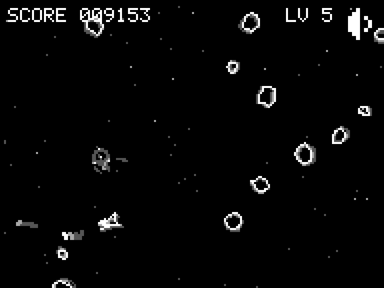

# My Space Drift

Juego web (PWA) jugable desde el navegador.

**Jugar:** https://elpatopotato.github.io/myspacedrift/



*La juega el bot de la demo: el GIF sale de `dev/capture-media.mjs`, que graba
una partida de verdad.*

- `index.html` — juego completo (canvas + JS)
- `sw.js` — service worker, cache-first (funciona offline tras la primera carga)
- `manifest.webmanifest` — instalable como app
- `icon-*.png` — iconos de la app, generados por `tools/make-icons.py`
- `.nojekyll` — evita que GitHub Pages procese el sitio con Jekyll

## Controles

Hacen falta dos dispositivos: la partida se abre en una pantalla grande (TV,
portátil) y el móvil hace de mando. La pantalla grande muestra un código de
seis dígitos; en el móvil se abre la misma URL con `?ctrl` y se escribe ahí
ese código.

No hace falta que estén en la misma red: sirve wifi, ethernet o datos
móviles, con que los dos tengan internet. El enlace intenta primero la vía
directa y, si el NAT no la deja pasar, sale por un servidor TURN de relevo.

El código de la pantalla no cambia al recargar: queda guardado, así que el
móvil se reconecta solo cuando la tele vuelve.

Ya en el mando, se toca:

- Lado izquierdo — propulsor izquierdo
- Lado derecho — propulsor derecho
- Ambos lados — freno

## Demo

El menú tiene tres opciones: `PLAY`, `DEMO` y `HIGH SCORES`. `DEMO` es para
mirar: la máquina juega una partida de verdad y el juego se explica solo
mientras ella vuela, así que sirve para enseñárselo a alguien sin tener que
narrarlo.

Se ve la partida entera —marcador, nivel, sonido y campo a plena luz— y encima
dos cosas que no están al jugar:

- La franja de abajo, la misma que muestra los controles en el menú, se
  **enciende** con el propulsor que la máquina está apretando en ese instante.
  La etiqueta está donde va el dedo en el mando, así que se lee sin traducir:
  se ve encenderse `LEFT THRUST` y a la nave girar hacia allá.
- Un cartel cuenta de a una regla, en el orden en que hacen falta para entender
  lo que se está viendo: primero que hay alguien volando, después cómo se gira,
  después que el freno no detiene del todo, y recién al final los puntos.

Cualquier toque —o cualquier propulsor— sale al menú, y vuelve con `PLAY`
marcado. El botón de sonido es el único que no saca de la demo. Si la máquina
choca, la partida se rearma sola: no entra al top 10 y la explicación sigue
donde iba.

Es distinta de la demo de fondo, la que arranca sola tras unos segundos sin
tocar nada en el menú: esa queda **detrás** de las opciones, apagada y en
silencio, para no competir con el menú. La elegida es la que enseña.

## Entrada de la nave

Cada partida empieza un momento antes de la partida: la nave **nace quieta,
fuera de la pantalla**, pegada a un borde al azar y con el morro girado al azar,
y entra manejando hasta el centro. Cuando llega, el mando pasa al jugador.

No es una animación aparte ni un guion: es la nave volando con las mismas
físicas de siempre —el mismo empuje de crucero, la misma inercia de giro, la
misma deriva, el mismo freno— traída por un autopiloto que solo tiene los dos
propulsores del jugador. El giro al azar es lo que hace que cada entrada sea
distinta: la nave tiene que corregir el rumbo mientras acelera.

Llega en dos tramos, porque frenar y girar son el mismo par de propulsores y no
se puede hacer las dos cosas a la vez: **lejos** cruza a fondo, afinando la
puntería cada vez más fino a medida que se acerca —el error de rumbo se paga
multiplicado por lo que falta—, y **cerca** (`CFG.entryBrake`) pone los dos
propulsores y entra recta, frenando. Así llega al centro al mínimo que permiten
las físicas, que es el piso del freno. La entrada termina en el punto más
cercano al centro, no en un radio: con avance constante la nave no puede
clavarse ahí.

**Mientras llega no hay campo**: la pantalla está limpia, no hay puntaje, ni
disparo, ni choques. Las rocas empiezan a entrar recién cuando el jugador tiene
el mando, y el campo se llena desde cero con la misma rampa que al subir de
nivel.

Que el mando todavía no es del jugador se ve, sin que nadie lo explique: la nave
llega **en gris** —en cuatro tonos, no ser el blanco pleno es diferencia
suficiente— y en el centro hay una **escuadra** marcando adónde la llevan, que se
va cerrando a medida que se acerca. Al llegar, la escuadra desaparece, sale un
anillo de donde está la nave y **la nave parpadea** medio segundo, apagándose de
verdad y no atenuándose: ese parpadeo es el aviso de que ya responde.

El borde por el que entra se sortea con peso inverso a lo que hay que cruzar
desde cada uno, y el punto dentro del borde tira al medio: en una tele ancha,
venir de una esquina del costado es cruzar media pantalla en diagonal y la
partida se hace esperar. Salen igual los cuatro bordes y el borde entero, solo
que lo cerca más seguido. La entrada típica dura poco más de dos segundos.

Las perillas están en `CFG` bajo `--- entrada de la nave ---`: `entryPad`,
`entrySpread`, `entryAim`, `entryLead`, `entryBrake`, `entryArrive`,
`entryGrace`, `entryMax`, y para lo que se ve, `entryTone`, `entryMark`,
`readyBlink` y `readyHz`.

## Partir meteoros

Casi siempre una bala revienta la roca entera, pero entre el 5% y el 10% de los
impactos —la probabilidad sube con la dificultad— la parte en dos por el medio.

El reparto no es 50/50: **cada mitad se queda con el 40% de la masa y el 20% que
sobra se va en polvo** por la línea del corte. Cada mitad es literalmente la roca
de antes cortada por la mitad —los mismos vértices, la misma orientación y la
misma velocidad que traía la madre—; el contorno cortado ronda el 50% del área,
así que se encoge lo justo para dejarlo en el 40% exacto sin cambiar de forma.

El corte va en la dirección de la marcha, así que las mitades se abren a los
lados con un ángulo al azar de entre 10° y 25°, simétrico, y ese abanico también
se abre con la dificultad: al empezar la partida el tope es 17.5° y solo al final
de la curva llega a los 25°. Como las dos mitades pesan lo mismo y se abren lo
mismo, el momento lateral se cancela solo.

Partir paga el 20% que se evaporó; el resto se cobra al terminar cada mitad. Si
las mitades fuesen a salir más chicas que `CFG.splitMinRadius`, no se parte nada:
la roca se rompe entera, para no dejar polvo invisible en pantalla.

Una mitad se puede volver a partir, pero con **la mitad de probabilidad** que su
madre (`CFG.splitDecay`), así que la cadena se agota sola: un cuarto de roca ya
parte con la cuarta parte de probabilidad.

## Giro de las rocas

Al nacer, cada roca gira poco y al azar: `CFG.meteorRotMax` es un giro de
crucero ligero, lo justo para que la piedra cabecee.

El golpe de la bala es lo que las pone a girar de verdad. Al partirse, cada
mitad recibe un giro proporcional a **la velocidad de la bala que la partió** —la
bala hereda la velocidad de la nave, así que disparar en marcha voltea más— y en
contra de su propio radio, que es como un cascote chico voltea más que uno
grande. Ese giro se **suma** al que la roca ya traía y sale en sentidos opuestos
para cada mitad, que es como se abre lo que se parte. `CFG.splitSpinGain` es la
ganancia y `CFG.splitSpinMax` el tope, para que nada acabe girando como una
licuadora.

Las perillas están en `CFG` bajo `--- particion ---`: `splitChanceMin/Max`,
`splitDecay`, `splitKeep`, `splitAngMin/Max`, `splitMinRadius`, `splitGap` (el
aire entre las mitades recién cortadas) y `splitSpinGain/Max`.

## Recolectables

Caen dos, y no se distinguen por color: en cuatro tonos el color no existe. El
problema real es el tamaño. El cuerpo mide **2,3 puntos de LCD de radio**, o sea
una figura de cinco por cinco, y a esa escala cualquier par de polígonos cae
sobre los mismos píxeles. Así que se separan por tres ejes a la vez, que son los
que sobreviven a cinco píxeles:

|        | escudo                 | reparación             |
| ------ | ---------------------- | ---------------------- |
| forma  | redonda y dispersa     | recta y plena          |
| giro   | orbita                 | quieta                 |
| ondas  | hacia afuera (irradia) | hacia adentro (absorbe)|

El **escudo** es un núcleo con tres satélites dando vueltas: cuatro puntos
sueltos que giran. Da seis segundos de invulnerabilidad, y mientras dura la nave
se ve más apagada y con el contorno punteado.

La **reparación** es una cruz gruesa alineada a los ejes —el símbolo de salud de
toda la vida— y va sin girar a propósito: quieta se distingue más, y además una
cruz que gira se convierte en una equis cada cuarto de vuelta y deja de ser una
cruz. Devuelve la vida perdida y el contorno completo del casco. Sólo cae si hay
algo que reparar.

## Estrellas del fondo

Detrás de todo hay un campo de puntos que titilan. Cada estrella es **un píxel
del LCD** y nada más: se sortean en coordenadas enteras del buffer, no en
unidades de mundo, así que miden lo mismo en cualquier pantalla.

El titileo es una sinusoide lenta, de entre 2,5 y 7 segundos, con fase propia
para que el cielo no lata al unísono. Lo que se ve no es la sinusoide sino los
escalones que cruza al cuantizar: la estrella se apaga, aparece en gris oscuro,
sube a gris claro y vuelve. Nunca llega al blanco pleno, que es el tono del
trazo del juego, y como el buffer mezcla por máximo una estrella no puede tapar
una roca ni la nave.

Las perillas están en `CFG`: `starDensity` (un punto cada tantos píxeles de
pantalla), `starPeriodMin/Max` y `starLo/starHi`.

## Records

El top 10 cuelga del código de la pantalla: cada código guarda su propia
tabla y se guarda firmada (HMAC-SHA-256 con clave derivada del código). Si
alguien edita el JSON desde el inspector, o pega la tabla de otro código, la
firma deja de cerrar y la tabla se descarta entera en vez de aceptar el
puntaje inventado.

Esto frena la edición a mano del almacenamiento, no a quien lea el código
fuente: el juego es estático y la clave viaja en `index.html`, así que un
top 10 realmente a prueba de trampas necesitaría un servidor que valide las
partidas.

Al caer a la tabla después de meter las iniciales, **las tuyas laten**: alternan
entre los dos tonos claros cada segundo y pico. En una tabla donde las diez filas
son tres letras, es lo único que dice cuál sos. Late el renglón de la partida que
acabás de jugar y nada más: entrando a HIGH SCORES desde el menú no hay partida
reciente, así que no late ninguno.

## Tinte de la pantalla

Escondido en el menú: cuatro toques seguidos sobre el título "MY SPACE DRIFT"
cambian el tinte del vidrio y el nombre del elegido aparece un segundo bajo la
raya. En escritorio hace lo mismo la tecla `T`, y desde el mando sirve la franja
de arriba al centro, que es donde cae el título en la tele. Los toques sueltos
no suenan ni hacen nada, y si tardan más de tres segundos entre uno y otro la
cuenta vuelve a cero, así que no se destapa sin querer.

Si el menú está en modo demo, el toque que corta la demo también cuenta: son
cuatro toques siempre, esté la demo puesta o no.

Los cuatro toques son para encontrarlo, no para usarlo: una vez destapado, el
título queda como un botón normal y basta **un toque** para pasar al siguiente
vidrio. Y como el tinte sólo se guarda después de haberlo destapado, tener uno
guardado ya cuenta como encontrado: quien lo descubrió una vez no vuelve a picar
cuatro veces nunca más, ni siquiera tras cerrar y reabrir el juego.

El ciclo pasa por MONO (el blanco y negro de siempre), GREEN, AMBER, RED,
MAGENTA, VIOLET, BLUE y CYAN. No son paletas distintas: la escena se cuantiza
a los mismos cuatro tonos y el color se multiplica al final, en el shader, que
es lo que hacía el vidrio de la consola. En pantalla sigue habiendo cuatro
tonos exactos, teñidos.

El elegido se guarda junto con el silencio, así que el vidrio sigue puesto al
volver a abrir el juego. La lista y la fuerza del filtro salen de `CFG.tints` y
`CFG.tintSat`; agregar un hue es agregar una línea.

## Cuadros por segundo

El juego se presenta al ritmo del hardware original: 4194304/70224 = 59,7275
pantallas por segundo. Sin ese tope, un móvil de 120 o 144 Hz lo dibuja "de
más" y se ve como un vídeo suave en vez de como la maquinita.

El reparto lo hace el propio panel: a 60, 120 o 240 Hz sale clavado en 60; en
uno que no sea múltiplo (144) cae en el divisor más cercano, que se ve mejor
que clavar 59,7275 a costa de tironear. El reloj del juego sigue siendo el de
verdad, así que el tope cambia cómo se ve, no a qué velocidad va la nave.
Se desactiva poniendo `CFG.gbHz` en 0.

## Instalar

Abrir el enlace en el móvil y usar "Añadir a pantalla de inicio". Tras la
primera carga el juego funciona sin conexión.

El emparejamiento usa PeerJS desde un CDN, así que la primera carga necesita
internet aunque después el juego arranque offline desde la caché. El enlace
con el móvil también pide internet cada vez: sin él la pantalla muestra
`LINK - no internet` y se juega tocando la propia pantalla.

## Desarrollo

Todo el juego vive en `index.html` (un solo archivo). Al cambiarlo, subir el
número de `CACHE` en `sw.js` para que el service worker sirva la versión nueva.

### Iconos

Los iconos no se editan a mano: se rasterizan desde la misma geometría de la
nave y la misma paleta de cuatro tonos que usa el juego, así que se regeneran
solos cuando cambia cualquiera de las dos.

```sh
pip install pillow
python3 tools/make-icons.py
```

El tinte del vidrio no entra: el icono es siempre MONO, que es como arranca
el juego.

### Comprobaciones

Fuera del juego, en `dev/` (no se precachean, necesitan `npm i -g playwright`):

```sh
node dev/audio-test.mjs     # renderiza cada sonido a PCM y lo comprueba
node dev/input-test.mjs     # que ningún control se quede pegado
node dev/entry-test.mjs     # que la nave entre bien al empezar cada partida
node dev/layout-test.mjs    # que el juego ocupe exactamente la pantalla visible
node dev/demo-test.mjs      # que las dos demos sigan siendo lo que son
npx http-server -p 8080     # y abre /dev/audio-lab.html para escuchar los sonidos
```

Los sonidos se sintetizan en el navegador (nada grabado, ningún archivo); las reglas de
diseño están en `.claude/skills/lcd-audio/SKILL.md`.

### Material para mostrarlo

`media/` no se precachea: son GIFs y fotos para enseñar el juego fuera, no
archivos del juego. Se regeneran con:

```sh
npm i -g ffmpeg-static            # además de playwright
node dev/capture-media.mjs
```

El juego no se deja fotografiar a mano —una captura del sistema lo reescala y
le mete medios tonos que en el LCD no existen—, así que la toma sale del
navegador y la vuela el mismo bot de la demo.

`marketing/reddit/` tiene el texto para publicarlo, la lista de subreddits y el
orden en que conviene ir.
