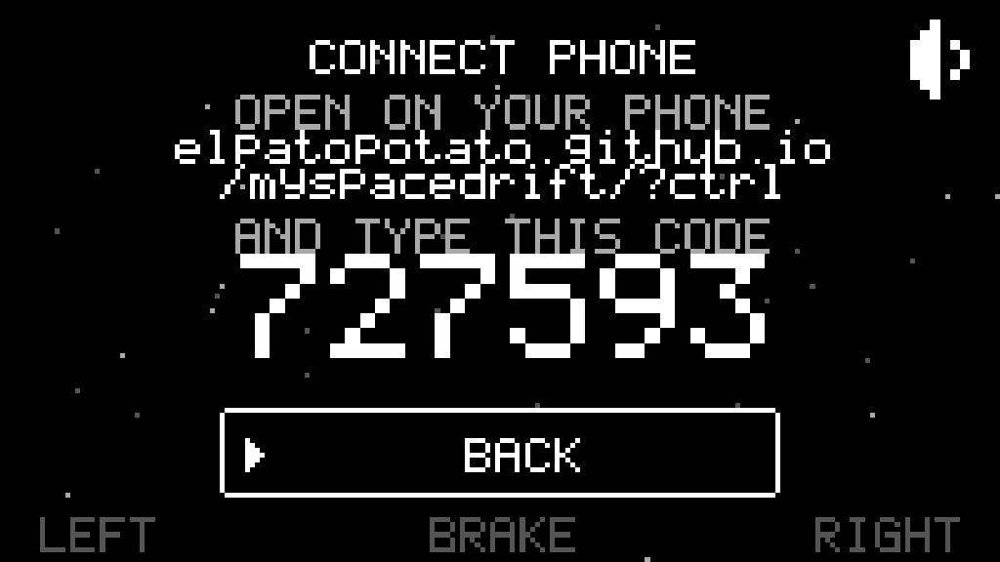

# My Space Drift

Juego web (PWA) jugable desde el navegador.

**Jugar:** https://elpatopotato.github.io/myspacedrift/


*La juega el bot de la demo: el GIF sale de `dev/capture-media.mjs`, que graba
una partida de verdad.*

- `index.html` — juego completo (canvas + JS)
- `sw.js` — service worker, cache-first (funciona offline tras la primera carga)
- `manifest.webmanifest` — instalable como app
- `icon-*.png` — iconos de la app, generados por `tools/make-icons.py`
- `.nojekyll` — evita que GitHub Pages procese el sitio con Jekyll

## Controles

Hacen falta dos dispositivos: la partida se abre en una pantalla grande (TV,
portátil) y el móvil hace de mando. En la pantalla grande se entra a **`CONNECT
PHONE`**, que muestra la dirección y un código de seis dígitos; en el móvil se
abre esa misma URL (la de siempre con `?ctrl`) y se escribe ahí ese código.



El emparejamiento vive en su propia pantalla a propósito. Antes el código estaba
siempre a la vista —al pie del menú y en una esquina del `GAME OVER`— y pagaban
las dos: en el menú se comía el alto que necesitaban las opciones y en el
`GAME OVER` se cruzaba con el título, justo cuando nadie lo está mirando. Ahora
lo busca quien quiere el mando, que es el único momento en que sirve.

No hace falta que estén en la misma red: sirve wifi, ethernet o datos
móviles, con que los dos tengan internet. El enlace intenta primero la vía
directa y, si el NAT no la deja pasar, sale por un servidor TURN de relevo.

El código de la pantalla no cambia al recargar: queda guardado, así que el
móvil se reconecta solo cuando la tele vuelve.

La dirección se parte en dos renglones cuando no entra de uno. Mide 245 puntos y
el LCD no pasa de `CFG.lcdCols`, así que se cortaba por los dos lados justo el
renglón que hay que teclear en el móvil. El corte va en la primera `/`: el
dominio arriba y el resto abajo, que es donde la vista ya corta sola.

Partirla hace crecer el bloque, y en 108 filas el alto no sobra, así que
`drawLink` reparte cediendo por utilidad: primero se achica el título (es
adorno) y solo al final el código, que es lo único que se lee de lejos. La
dirección no se corta nunca y el código no se saca nunca: sin esos dos la
pantalla no sirve para lo único que hace.

### El mando

El mando es un mando: dos botones grandes que ocupan la pantalla del móvil y se
**encienden** mientras el dedo los aprieta.

- `LEFT` — propulsor izquierdo
- `RIGHT` — propulsor derecho
- Los dos a la vez — freno; en los menús, elegir

Antes el móvil mostraba una miniatura de la pantalla del juego —el mismo formato
que la tele, letterbox incluido— y mandaba la posición exacta del dedo. Se veía
como una franja apaisada flotando en el medio de la nada y había que *apuntar* a
una mitad en vez de apretar un botón. Ahora cada dedo se manda como un punto en
el centro del lado que aprieta, así que del lado de la tele no cambió nada: para
el juego sigue siendo un dedo apoyado en esa mitad de su pantalla.

El lado sale de la mitad de la pantalla del móvil y no del botón que recibió el
toque, así que el hueco entre los dos y el margen del aparato también cuentan, y
arrastrar el dedo de un motor al otro cambia de motor sin levantarlo.

Los menús se manejan desde el mando con esos mismos dos botones: uno mueve la
selección y los dos juntos eligen (§4.2).

## Demo

El menú tiene cuatro opciones: `PLAY`, `DEMO`, `HIGH SCORES` y `CONNECT PHONE`.
`DEMO` es para mirar: la máquina juega una partida de verdad y el juego se
explica solo mientras ella vuela, así que sirve para enseñárselo a alguien sin
tener que narrarlo.

Se ve la partida entera —marcador, nivel, sonido y campo a plena luz— y encima
dos cosas que no están al jugar:

- La franja de abajo, la misma que muestra los controles en el menú, se
  **enciende** con el propulsor que la máquina está apretando en ese instante.
  La etiqueta está donde va el dedo en el mando, así que se lee sin traducir:
  se ve encenderse `LEFT THRUST` y a la nave girar hacia allá.
- Un cartel cuenta de a una regla, en el orden en que hacen falta para entender
  lo que se está viendo: primero que hay alguien volando, después cómo se gira,
  después que el freno no detiene del todo, y recién al final los puntos.

Cualquier toque —o cualquier propulsor— sale al menú, y vuelve con `PLAY`
marcado. El botón de sonido es el único que no saca de la demo. Si la máquina
choca, la partida se rearma sola: no entra al top 10 y la explicación sigue
donde iba.

Es distinta de la demo de fondo, la que arranca sola tras unos segundos sin
tocar nada en el menú: esa queda **detrás** de las opciones, apagada y en
silencio, para no competir con el menú. La elegida es la que enseña.

## Entrada de la nave

Cada partida empieza un momento antes de la partida: la nave **nace quieta,
fuera de la pantalla**, pegada a un borde al azar y con el morro girado al azar,
y entra manejando hasta el centro. Cuando llega, el mando pasa al jugador.

No es una animación aparte ni un guion: es la nave volando con las mismas
físicas de siempre —el mismo empuje de crucero, la misma inercia de giro, la
misma deriva, el mismo freno— traída por un autopiloto que solo tiene los dos
propulsores del jugador. El giro al azar es lo que hace que cada entrada sea
distinta: la nave tiene que corregir el rumbo mientras acelera.

Llega en dos tramos, porque frenar y girar son el mismo par de propulsores y no
se puede hacer las dos cosas a la vez: **lejos** cruza a fondo, afinando la
puntería cada vez más fino a medida que se acerca —el error de rumbo se paga
multiplicado por lo que falta—, y **cerca** (`CFG.entryBrake`) pone los dos
propulsores y entra recta, frenando. Así llega al centro al mínimo que permiten
las físicas, que es el piso del freno. La entrada termina en el punto más
cercano al centro, no en un radio: con avance constante la nave no puede
clavarse ahí.

**Mientras llega no hay campo**: la pantalla está limpia, no hay puntaje, ni
disparo, ni choques. Las rocas empiezan a entrar recién cuando el jugador tiene
el mando, y el campo se llena desde cero con la misma rampa que al subir de
nivel.

Que el mando todavía no es del jugador se ve, sin que nadie lo explique: la nave
llega **en gris** —en cuatro tonos, no ser el blanco pleno es diferencia
suficiente— y en el centro hay una **escuadra** marcando adónde la llevan, que se
va cerrando a medida que se acerca. Al llegar, la escuadra desaparece, sale un
anillo de donde está la nave y **la nave parpadea** medio segundo, apagándose de
verdad y no atenuándose: ese parpadeo es el aviso de que ya responde.

El borde por el que entra se sortea con peso inverso a lo que hay que cruzar
desde cada uno, y el punto dentro del borde tira al medio: en una tele ancha,
venir de una esquina del costado es cruzar media pantalla en diagonal y la
partida se hace esperar. Salen igual los cuatro bordes y el borde entero, solo
que lo cerca más seguido. La entrada típica dura poco más de dos segundos.

Las perillas están en `CFG` bajo `--- entrada de la nave ---`: `entryPad`,
`entrySpread`, `entryAim`, `entryLead`, `entryBrake`, `entryArrive`,
`entryGrace`, `entryMax`, y para lo que se ve, `entryTone`, `entryMark`,
`readyBlink` y `readyHz`.

## Con qué choca cada cosa

Todo choca con **la forma que se ve**, no con un círculo que la envuelve. Las
rocas siempre fueron su polígono exacto; la nave y la bala no, y eso producía dos
mentiras bien visibles.

La bala se probaba como **un punto**, aunque en pantalla es una raya de hasta diez
unidades que tumbea sobre su centro. Un tiro que visualmente atravesaba la roca no
le hacía nada. Ahora se prueba la raya entera, con el largo que tiene en ese
frame: como se va encogiendo al apagarse, una bala moribunda pega menos que una
recién salida, que es justo lo que se ve.

La nave chocaba con un **círculo de radio 11** contra un casco de 27 × 20,25. Pero
el casco no es redondo: el morro llega a 13,5 del centro y el flanco a 4,74. O sea
que moría por rocas que le pasaban por el costado y sobrevivía roces de punta. El
círculo era el doble de área que el casco de verdad.

Ahora la nave usa su contorno, en dos tamaños distintos a propósito:

|        | forma                     | para qué                        |
| ------ | ------------------------- | ------------------------------- |
| daño   | el contorno **encogido**  | morir tiene que ser siempre creíble |
| agarre | el contorno **pelado**    | recoger no tiene que fallar por un flanco |

Es el único par donde achicar el hitbox le juega **en contra** al jugador, y los
recolectables ya son bastante raros como para además perderlos rozándolos. Chico
para morir, honesto para recolectar.

Los segmentos que se apagan al perder una vida no agujerean el hitbox: son el
indicador de vidas, y una nave dañada más difícil de matar sería al revés de lo
que cuenta.

**El objeto es la línea central del trazo.** El nib es solo con qué gordura lo
pinta el LCD, no parte de la cosa — y es lo que hace que el juego se juegue igual
en cualquier pantalla. El mundo se mide en unidades propias y su alto vale siempre
`baseHeight`, así que la nave mide 27 unidades en todos lados; un píxel encendido,
en cambio, mide entre 3,3 y 4,5 unidades según lo ancha que sea la ventana.
Colisionar "por los píxeles que se tocan" sería un juego distinto en cada monitor.
`dev/collide-test.mjs` corre los mismos casos en dos pantallas con puntos de LCD
un 38% distintos y exige el mismo veredicto en todos.

`CFG.shipRadius` sigue existiendo pero **ya no es el hitbox**: es el radio de
guarda de la justicia de spawn, donde conviene que sobre porque mide "cerca de la
nave", no "tocando la nave".

## Partir meteoros

Casi siempre una bala revienta la roca entera, pero entre el 5% y el 10% de los
impactos —la probabilidad sube con la dificultad— la parte en dos por el medio.

El reparto no es 50/50: **cada mitad se queda con el 40% de la masa y el 20% que
sobra se va en polvo** por la línea del corte. Cada mitad es literalmente la roca
de antes cortada por la mitad —los mismos vértices, la misma orientación y la
misma velocidad que traía la madre—; el contorno cortado ronda el 50% del área,
así que se encoge lo justo para dejarlo en el 40% exacto sin cambiar de forma.

El corte va en la dirección de la marcha, así que las mitades se abren a los
lados con un ángulo al azar de entre 10° y 25°, simétrico, y ese abanico también
se abre con la dificultad: al empezar la partida el tope es 17.5° y solo al final
de la curva llega a los 25°. Como las dos mitades pesan lo mismo y se abren lo
mismo, el momento lateral se cancela solo.

Partir paga el 20% que se evaporó; el resto se cobra al terminar cada mitad. Si
las mitades fuesen a salir más chicas que `CFG.splitMinRadius`, no se parte nada:
la roca se rompe entera, para no dejar polvo invisible en pantalla.

Una mitad se puede volver a partir, pero con **la mitad de probabilidad** que su
madre (`CFG.splitDecay`), así que la cadena se agota sola: un cuarto de roca ya
parte con la cuarta parte de probabilidad.

Y las mitades **pagan más pickup**: un 20 % por encima de lo que pagaría una roca
entera del mismo tamaño (`CFG.shardDropBonus`). Partir es el tiro difícil y hasta
ahora lo único que daba era más blancos que esquivar. El extra es plano, no se
compone: dos cortes seguidos siguen pagando un 20 %, no un 44 %.

## Giro de las rocas

Al nacer, cada roca gira poco y al azar: `CFG.meteorRotMax` es un giro de
crucero ligero, lo justo para que la piedra cabecee.

El golpe de la bala es lo que las pone a girar de verdad. Al partirse, cada
mitad recibe un giro proporcional a **la velocidad de la bala que la partió** —la
bala hereda la velocidad de la nave, así que disparar en marcha voltea más— y en
contra de su propio radio, que es como un cascote chico voltea más que uno
grande. Ese giro se **suma** al que la roca ya traía y sale en sentidos opuestos
para cada mitad, que es como se abre lo que se parte. `CFG.splitSpinGain` es la
ganancia y `CFG.splitSpinMax` el tope, para que nada acabe girando como una
licuadora.

Las perillas están en `CFG` bajo `--- particion ---`: `splitChanceMin/Max`,
`splitDecay`, `splitKeep`, `splitAngMin/Max`, `splitMinRadius`, `splitGap` (el
aire entre las mitades recién cortadas) y `splitSpinGain/Max`.

## Recolectables

Caen cinco, y no se distinguen por color: en cuatro tonos el color no existe. El
problema real es el tamaño. El cuerpo mide **2,3 puntos de LCD de radio**, o sea
una figura de cinco por cinco, y a esa escala cualquier par de polígonos cae
sobre los mismos píxeles. Así que se separan por varios ejes a la vez, que son
los que sobreviven a cinco píxeles:

|            | forma              | giro           | ondas                   |
| ---------- | ------------------ | -------------- | ----------------------- |
| escudo     | redonda y dispersa | orbita         | hacia afuera (irradia)  |
| reparación | cruz recta y plena | quieta         | hacia adentro (absorbe) |
| abanico    | tres brazos en V   | abre y cierra  | hacia afuera            |
| perforante | barra alargada     | sobre su eje   | hacia afuera            |
| ancla      | cuadrado macizo    | ninguno        | ninguna (late en tamaño)|

Los tres nuevos no dan más números: cambian **cómo** se juega. Duran ocho
segundos, se apilan entre ellos y no se apilan consigo mismos.

El **escudo** es un núcleo con tres satélites dando vueltas. Ya no da
invulnerabilidad —eso era invisibilidad, no escudo—: pone una **burbuja** que se
come **un** golpe y revienta, o se agota a los seis segundos. La burbuja se
dibuja más grande que la nave pero **no agranda el blanco**: lo que choca sigue
siendo `shipRadius`, porque agrandarlo haría chocar contra rocas que hoy se
esquivan y eso se lee como «el escudo me mató».

La **reparación** es una cruz gruesa alineada a los ejes —el símbolo de salud de
toda la vida— y va sin girar a propósito: quieta se distingue más, y además una
cruz que gira se convierte en una equis cada cuarto de vuelta y deja de ser una
cruz. Devuelve la vida perdida y el contorno completo del casco. Sólo cae si hay
algo que reparar.

El **abanico** dispara tres balas en vez de una: cambia puntería por cobertura.
La **perforante** atraviesa las rocas en lugar de morir en la primera, así que
premia alinear el tiro. El **ancla** le quita la deriva a la nave: durante ocho
segundos va exactamente a donde apunta, que en un juego llamado *My Space Drift*
es el cambio de pilotaje más grande que hay.

### Infectados

Cualquier recolectable puede venir **infectado**: hace lo contrario de lo que
promete y dura el 70 %. El escudo no protege y te cruza los mandos, la reparación
no cura y te cruza los mandos, el abanico sortea cada ángulo y te deja sin
puntería, la perforante apenas saca la bala del morro y el ancla te hace patinar.

Se reconocen por dos marcas a la vez: una **fisura** encima de la figura y, sobre
todo, que están **completamente detenidos** —no respiran, no giran, no emiten
ondas—. No se finge un tirón a propósito: el juego tiene tope de cuadros y a
veces los da de verdad, así que un *glitch* simulado se leería como falla de
rendimiento y el jugador culparía al juego en vez de leer la señal. De ahí sale
una regla dura para las cinco figuras: **ninguna limpia puede quedarse quieta**,
o la infección deja de leerse.

### Cuándo caen

Siguen cayendo sólo al reventar una roca, con `dropChance` sesgada por tamaño y
con el extra del 20 % de las mitades partidas (`shardDropBonus`).
Encima va un **freno por saturación** que cuenta los *existentes* —los que la
nave tiene puestos más los que siguen volando—: con dos cae la mitad y con tres
no cae nada. Es realimentación negativa, y es lo que sostiene el promedio de uno
sin necesidad de un reloj de aparición: cuanto más tenés, menos te toca.

Y no se agarran de rebote. El pickup nace **inerte** y sólo se arma tras medio
segundo con la nave fuera de su radio (`pickupArm`), porque nace justo donde
acabás de tirar —muchas veces encima de la nave— y agarrarlo sin haberlo mirado
era gratis mientras los dos eran regalos; con uno de cada seis infectado sería
una trampa.

Las perillas están en `CFG` bajo `--- pickup ---` y `--- efectos de estilo ---`:
`dropChance`, `dropSizeBias`, `pickupArm`, `shieldRadius`, `pickupWeights`,
`shardDropBonus`, `fxTime`, `fxBlink`, `infectChance`, `infectTimeMul`,
`crowdedAt`, `crowdedMul`, `fxHardCap` y `fxSweep`.

### Cómo se agarran

Para agarrarlos, los cinco valen **el mismo radio**: el del cuerpo en el pico de
su latido, contra el contorno pelado de la nave. Que sea el pico y no el valor
del frame es a propósito —agarrar no puede depender de en qué parte de la
respiración cayó el cuadro, y así nunca queda un punto encendido fuera del
hitbox—. Los satélites del escudo, los brazos del abanico, la barra de la
perforante y las ondas de todos **no cuentan**: lo que gira ataría el agarre a la
fase de la rotación y dejaría unos más fáciles de recoger que otros sin ninguna
razón. Las ondas son decoración.

La cruz tampoco se toma literal: se agarra como un disco, porque si no habría que
llegarle por el eje X o el Y y no en diagonal. Lo mismo vale para el cuadrado del
ancla y la barra de la perforante.

Ese contacto es la condición necesaria, no la suficiente: además el pickup tiene
que estar **armado** (ver arriba).

## Estrellas del fondo

Detrás de todo hay un campo de puntos que titilan. Cada estrella es **un píxel
del LCD** y nada más: se sortean en coordenadas enteras del buffer, no en
unidades de mundo, así que miden lo mismo en cualquier pantalla.

El titileo es una sinusoide lenta, de entre 2,5 y 7 segundos, con fase propia
para que el cielo no lata al unísono. Lo que se ve no es la sinusoide sino los
escalones que cruza al cuantizar: la estrella se apaga, aparece en gris oscuro,
sube a gris claro y vuelve. Nunca llega al blanco pleno, que es el tono del
trazo del juego, y como el buffer mezcla por máximo una estrella no puede tapar
una roca ni la nave.

Las perillas están en `CFG`: `starDensity` (un punto cada tantos píxeles de
pantalla), `starPeriodMin/Max` y `starLo/starHi`.

## Records

El top 10 cuelga del código de la pantalla: cada código guarda su propia
tabla y se guarda firmada (HMAC-SHA-256 con clave derivada del código). Si
alguien edita el JSON desde el inspector, o pega la tabla de otro código, la
firma deja de cerrar y la tabla se descarta entera en vez de aceptar el
puntaje inventado.

Esto frena la edición a mano del almacenamiento, no a quien lea el código
fuente: el juego es estático y la clave viaja en `index.html`, así que un
top 10 realmente a prueba de trampas necesitaría un servidor que valide las
partidas.

Al caer a la tabla después de meter las iniciales, **las tuyas laten**: alternan
entre los dos tonos claros cada segundo y pico. En una tabla donde las diez filas
son tres letras, es lo único que dice cuál sos. Late el renglón de la partida que
acabás de jugar y nada más: entrando a HIGH SCORES desde el menú no hay partida
reciente, así que no late ninguno.

## Tinte de la pantalla

Escondido en el menú: cuatro toques seguidos sobre el título "MY SPACE DRIFT"
cambian el tinte del vidrio y el nombre del elegido aparece un segundo bajo la
raya. En escritorio hace lo mismo la tecla `T`, y desde el mando sirve la franja
de arriba al centro, que es donde cae el título en la tele. Los toques sueltos
no suenan ni hacen nada, y si tardan más de tres segundos entre uno y otro la
cuenta vuelve a cero, así que no se destapa sin querer.

Si el menú está en modo demo, el toque que corta la demo también cuenta: son
cuatro toques siempre, esté la demo puesta o no.

Los cuatro toques son para encontrarlo, no para usarlo: una vez destapado, el
título queda como un botón normal y basta **un toque** para pasar al siguiente
vidrio. Y como el tinte sólo se guarda después de haberlo destapado, tener uno
guardado ya cuenta como encontrado: quien lo descubrió una vez no vuelve a picar
cuatro veces nunca más, ni siquiera tras cerrar y reabrir el juego.

El ciclo pasa por MONO (el blanco y negro de siempre), GREEN, AMBER, RED,
MAGENTA, VIOLET, BLUE y CYAN. No son paletas distintas: la escena se cuantiza
a los mismos cuatro tonos y el color se multiplica al final, en el shader, que
es lo que hacía el vidrio de la consola. En pantalla sigue habiendo cuatro
tonos exactos, teñidos.

El elegido se guarda junto con el silencio, así que el vidrio sigue puesto al
volver a abrir el juego. La lista y la fuerza del filtro salen de `CFG.tints` y
`CFG.tintSat`; agregar un hue es agregar una línea.

## Cuántos puntos tiene la pantalla

La Game Boy tenía 160×144 puntos, y eran **siempre esos**. Acá también:
**192×108, en todo aparato**. La relación de aspecto está bloqueada en 16:9, el
lienzo se encoge al mayor 16:9 que entre en la ventana y lo que sobra queda en
negro.

Antes el lienzo llenaba la pantalla y el mundo se estiraba con ella, así que la
retícula salía distinta en cada sitio:

| | tele 16:9 | portátil 16:10 | móvil 844×390 | con barra | 21:9 |
| --- | --- | --- | --- | --- | --- |
| retícula antes | 200×113 | 200×125 | 225×104 | 266×104 | 247×104 |
| ancho de mundo | 853 | 768 | 1039 | 1231 | 1138 |
| **ahora** | **192×108** | **192×108** | **192×108** | **192×108** | **192×108** |

No era sólo que el punto cambiara de tamaño: cambiaba **cuánto mundo entraba en
cuadro**. Y como el juego apunta a un número fijo de rocas sin mirar el ancho,
esas mismas rocas se repartían en más área en un monitor panorámico: el juego
era *más fácil* en 21:9 que en un portátil. Bloquear el aspecto lo arregla sin
tocar el spawn.

### Por qué 192×108 y no otra

No se eligió: es la única que cabe. 16:9 exacto pide filas múltiplo de 9, y las
dos restricciones que ya existían dejan una sola posibilidad:

- **Por arriba, unas 200 columnas.** La consola tenía 160, y pasado ese entorno
  el juego deja de verse pixelado: se ve **fino**. Sin techo el ancho se iba a
  256 puntos en una tele y 368 en un móvil con la barra puesta.
- **Por abajo, 104 filas.** Es donde la interfaz deja de entrar: a 96 la línea
  de ayuda del menú se monta sobre la franja de controles.

| rejilla | |
| --- | --- |
| 176×99 | 99 filas: la interfaz se rompe |
| **192×108** | **la única que entra** |
| 208×117 | 208 columnas: se ve fino |
| 224×126 · 240×135 · 256×144 | más ancho todavía |

Y sale redonda, sin arrastre de redondeo:

```js
PIX = CFG.lcdRows / CFG.baseHeight;   // 108/480 = 0,225
W   = CFG.lcdCols / PIX;              // 192/0,225 = 853,33
// W/H = 853,33/480 = 16/9 exacto, y W*PIX da 192 clavado
```

### Las barras

Lo que sobra de ventana queda negro. Cuánto sobra depende del aparato: nada en
una tele 16:9, un 10% del alto en un portátil 16:10, un 18% del ancho en un
móvil de 21,6:9 y un 25% en una ultrapanorámica o en un 4:3.

En la práctica **no se ven como barras**, porque el fondo del juego ya es negro:
lo que se nota es que el cuadro es un poco más chico y va centrado. Es lo mismo
que hace cualquier aparato de resolución fija, y encaja con la ficción: el
vidrio no llega hasta el borde de la carcasa.

Dos cosas se acomodan a que el lienzo ya no toque los bordes físicos:

- **Los márgenes seguros** (notch, isla, barra de gestos) son de la *ventana*, y
  del recorte sólo tapa lo que le sobre a la barra negra. `safeCut()` resta la
  barra, así que el HUD recupera sitio justo en los aparatos donde más escasea.
- **La pantalla de rotar** se dispara con los píxeles del aparato, no con las
  medidas del mundo. Con el mundo clavado en 16:9 el alto ya nunca supera al
  ancho, así que comparándolos la pantalla habría quedado inalcanzable y un
  móvil en vertical mostraría una franja diminuta en vez de pedir que lo giren.

### La interfaz reparte el alto igual

Con 108 filas fijas ya no hay filas que negociar, pero el reparto sigue puesto:
se degenera solo a una única respuesta, y mantenerlo significa que la interfaz
sigue entrando si algún día la rejilla cambia.

- El **menú**, el **`GAME OVER`** y la pantalla del mando reparten el alto antes
  de dibujar, en vez de anclar cada cosa a una fila fija de la rejilla: el
  bloque de abajo se apoya sobre la franja de controles y el resto se acomoda en
  lo que sobra. Lo primero que se cae es la ayuda de navegación (`L/R — MOVE`),
  que repite lo que ya dice la franja; después el tamaño del título.
- El **top 10** pasa a dos columnas cuando las diez filas no entran en una. En
  dos columnas se cae el nivel, que es lo único prescindible: la tabla ordena
  por puntaje, nunca por nivel.

## Estela fantasma

El LCD de la consola tardaba en apagarse, así que todo lo que se movía dejaba
un rastro. Acá lo hace `CFG.trailFade`: cada cuadro el buffer de intensidad se
apaga un poco, y como la escena se cuantiza a cuatro tonos, detrás de cada roca
quedan tres generaciones —blanco, gris claro, gris oscuro— antes de apagarse.

Ese apagado se mide en **tiempo, no en cuadros**. Es lo que evita que la estela
se vuelva otra cosa: si se apagara por cuadro, un aparato que tironea haría que
la roca saltase el doble o el triple entre cuadro y cuadro mientras el fantasma
sigue durando tres cuadros, así que el rastro se estira, las generaciones dejan
de tocarse y lo que se ve no es una estela sino **dos copias sueltas de la roca
al lado de la roca**. Por tiempo, el cuadro largo apaga de más y el rastro mide
siempre lo mismo. `CFG.trailFade` sigue expresado por cuadro de 60 Hz, que es
donde se ajusta a ojo; `VRAM.fade` lo pasa a tiempo real.

## Cuadros por segundo

El juego se presenta al ritmo del hardware original: 4194304/70224 = 59,7275
pantallas por segundo. Sin ese tope, un móvil de 120 o 144 Hz lo dibuja "de
más" y se ve como un vídeo suave en vez de como la maquinita.

El reparto lo hace el propio panel: a 60, 120 o 240 Hz sale clavado en 60; en
uno que no sea múltiplo (144) cae en el divisor más cercano, que se ve mejor
que clavar 59,7275 a costa de tironear. El reloj del juego sigue siendo el de
verdad, así que el tope cambia cómo se ve, no a qué velocidad va la nave.
Se desactiva poniendo `CFG.gbHz` en 0.

## Instalar

Abrir el enlace en el móvil y usar "Añadir a pantalla de inicio". Tras la
primera carga el juego funciona sin conexión.

El emparejamiento usa PeerJS desde un CDN, así que la primera carga necesita
internet aunque después el juego arranque offline desde la caché. El enlace
con el móvil también pide internet cada vez: sin él la pantalla muestra
`LINK - no internet` y se juega tocando la propia pantalla.

## Desarrollo

Todo el juego vive en `index.html` (un solo archivo). Al cambiarlo, subir el
número de `CACHE` en `sw.js` para que el service worker sirva la versión nueva.

### Iconos

Los iconos no se editan a mano: se rasterizan desde la misma geometría de la
nave y la misma paleta de cuatro tonos que usa el juego, así que se regeneran
solos cuando cambia cualquiera de las dos.

```sh
pip install pillow
python3 tools/make-icons.py
```

El tinte del vidrio no entra: el icono es siempre MONO, que es como arranca
el juego.

### Comprobaciones

Fuera del juego, en `dev/` (no se precachean, necesitan `npm i -g playwright`):

```sh
node dev/audio-test.mjs     # renderiza cada sonido a PCM y lo comprueba
node dev/input-test.mjs     # que ningún control se quede pegado
node dev/entry-test.mjs     # que la nave entre bien al empezar cada partida
node dev/layout-test.mjs    # que el juego ocupe exactamente la pantalla visible
node dev/demo-test.mjs      # que las dos demos sigan siendo lo que son
node dev/trail-test.mjs     # que la estela no se estire si el aparato tironea
node dev/lcd-test.mjs       # que la reticula no se desmadre de ancho en ninguna pantalla
node dev/pickup-test.mjs    # los cinco recolectables, sus infectados y las reglas que los frenan
node dev/collide-test.mjs   # que cada cosa choque con la forma que se ve, y en toda pantalla igual
node dev/bot-score.mjs      # cuánto puntúa el bot con dos vidas: la vara de dificultad
npx http-server -p 8080     # y abre /dev/audio-lab.html para escuchar los sonidos
```

Los sonidos se sintetizan en el navegador (nada grabado, ningún archivo); las reglas de
diseño están en `.claude/skills/lcd-audio/SKILL.md`.

Para ver los hitboxes, en la consola del juego:

```js
DBG.hitbox = true      // dibuja el contorno de daño, el de agarre y la raya de cada bala
```

Se dibuja con las mismas primitivas que el mundo, así que lo que se ve es
literalmente lo que se calcula. Que esto no existiera es la razón por la que la
bala fue un punto sin dimensión durante toda la vida del proyecto sin que nadie
lo notara.

### Publicar en itch.io

```sh
tools/publish-itch.sh --dry-run   # dice qué subiría
tools/publish-itch.sh             # lo sube
```

Lo que se sube no es el repositorio: es el juego. La lista sale del propio service
worker —`FILES` en `sw.js` es, por definición, todo lo que el juego necesita para
arrancar sin internet— más el `sw.js`, así que no hay dos listas que se puedan
desincronizar y ni `dev/`, ni `media/`, ni `marketing/`, ni este README viajan a la
ficha. La versión de la build también sale de ahí: el número de `CACHE`, que es el
que ya hay que subir cada vez que cambia `index.html`.

Hace falta [butler](https://itch.io/docs/butler/installing.html) y estar autenticado
(`butler login` una vez, o `BUTLER_API_KEY` si se hace desde CI). El destino se
cambia sin tocar el archivo: `ITCH_TARGET=usuario/juego tools/publish-itch.sh`.

El texto de la ficha —título, tagline, descripción y las casillas de itch— está en
`marketing/itch/PAGE.md`, listo para copiar.

**Una cosa que hay que decidir antes de publicar ahí:** la pantalla `CONNECT PHONE`
anuncia la dirección desde la que se está sirviendo el juego, y en itch.io eso es un
dominio de CDN dentro
de un iframe (`v6p9d9t4.ssl.hwcdn.net/html/…`), o sea un renglón que no se puede
teclear en un celular. Así que, o el emparejamiento no se anuncia en esa ficha, o el
juego pasa a publicar siempre la dirección pública en vez de la suya (una línea en
`Link.url()`, subiendo el `CACHE` de `sw.js`).

### Material para mostrarlo

`media/` no se precachea: son GIFs y fotos para enseñar el juego fuera, no
archivos del juego. Se regeneran con:

```sh
npm i -g ffmpeg-static            # además de playwright
node dev/capture-media.mjs
```

El juego no se deja fotografiar a mano —una captura del sistema lo reescala y
le mete medios tonos que en el LCD no existen—, así que la toma sale del
navegador y la vuela el mismo bot de la demo.

`marketing/reddit/` tiene el texto para publicarlo, la lista de subreddits y el
orden en que conviene ir.

#### Cinco fotos más

`capture-media.mjs` saca las cuatro básicas —menú, campo, cartel de nivel y tabla
de records— y además graba los GIFs, que tarda minutos. Las otras cinco van
aparte, y salen en segundos:

```sh
node dev/capture-shots.mjs             # las cinco
node dev/capture-shots.mjs demo split  # o solo algunas
```

No enseñan pantallas: enseñan lo que el juego **tiene** y una foto del campo no
cuenta.

| | qué muestra |
| --- | --- |
| `shot-demo.png` | la máquina jugando: el cartel que explica y la franja de abajo encendida en el motor que está apretando |
| `shot-pickups.png` | los dos recolectables juntos, que jugando casi nunca coinciden: la cruz quieta y el núcleo con satélites en órbita |
| `shot-split.png` | una roca partida en dos, con su polvo y el anillo del golpe |
| `shot-tint.png` | el menú con el cristal verde: el easter egg del tinte, y la única foto en color |
| `shot-phone.png` | el celular haciendo de mando, que es la mitad del juego y no sale en ninguna captura de la tele |

Tampoco acá hay montaje: cada foto es el juego corriendo, volado por el mismo bot
de la demo. Lo único que se hace es ponerlo en la situación —darle los dos
recolectables, partir una roca, girar el vidrio— y esperar al cuadro que sirve.

Y esperar al cuadro que sirve es literal. El obturador va enganchado a `frame`,
el bucle del juego: se deja que actualice y **dibuje**, y recién ahí se pregunta
si el cuadro sirve. Mirándolo desde un `requestAnimationFrame` aparte no alcanza,
porque el del script y el del juego caen en la misma tanda y el del juego puede
correr después: lo que se fotografía es entonces el cuadro *siguiente* al que se
aprobó. Con cosas que duran dos cuadros —el motor que la máquina tiene apretado
ahora mismo— eso es la diferencia entre la foto que se buscaba y otra: pidiendo
un solo motor salía la del freno. Y para cortar no basta con pisar
`requestAnimationFrame`, porque el juego se reagenda en su primera línea y ese
cuadro ya pedido se dibuja igual encima del bueno; hay una bandera que lo manda
de vuelta sin dibujar.

Dos fotos se arman con el juego ya congelado, que es cuando se puede elegir
dónde va cada cosa mirando dónde **no** hay nada: los recolectables buscan el
hueco más despejado alrededor de la nave (a esta escala miden cinco píxeles, así
que encima de una roca no se ven) y después se pide un cuadro suelto para
dibujarlos.

Las cinco salen en la misma ventana, 960×540. La retícula es 192×108 en cualquier
aparato, así que ya no hay un 4:3 que muestre más filas ni un 16:9 que muestre más
mundo: elegir forma de ventana sólo cambia el tamaño del punto, y 960 entre 192 da
cinco píxeles por punto, enteros. Cualquier otra forma se llena de negro arriba y
abajo, porque el lienzo se encoge al mayor 16:9 que entre.

La del tinte enseña el **vidrio**, no el nombre. Antes iba aparte, en 4:3, justo para
pescar el cartel `TINT GREEN`: con la retícula vieja el alto cambiaba con la pantalla y
en 4:3 (144 filas) el cuadro del menú caía en la fila 40 y lo dejaba libre. Clavada en
192×108 el cuadro empieza siempre en la 24 y el cartel ocupa de la 30 a la 37, así que
queda tapado en toda pantalla —`drawMenu` lo dibuja antes que el cuadro— y no hay ventana
desde la que fotografiarlo.

#### La portada de itch.io

`media/cover.png` mide 630×500, que es lo que muestra la ficha de itch.io, y
sale de donde sale todo lo demás: la dibuja el juego. El reparto y el porqué de
cada número están en `dev/cover-art.mjs`, que es el módulo que comparten las dos
capturas de abajo.

```sh
node dev/capture-cover.mjs        # solo playwright, sin ffmpeg
```


Dos números la definen:

- **126 × 100 puntos a 5 píxeles el punto** son 630×500 exactos. El punto tiene
  que caer entero: si no, la retícula cojea —celdas de tres píxeles al lado de
  celdas de cuatro— y se ensucia justo lo que hace reconocible al juego.
- **0,8 puntos por unidad de mundo**, contra los 0,3 de la pantalla de verdad. A
  la escala del juego la nave mide ocho puntos, y en la miniatura de la tienda
  eso es una mota; acá mide veintidós. Es la misma nave, con el mismo trazo de un
  punto y la misma física: cambia a qué distancia se la mira, no cómo está hecha.

La escena no es un cuadro robado a una partida. En una partida la nave está
donde está, y una portada necesita el nombre con su sitio libre y la nave
apuntando hacia adentro, así que las piezas se colocan a mano —`LAYOUT.scene`, en
puntos de LCD— y después se las deja volar unos cuadros para que quede la estela.
Lo que se ve sigue siendo el juego, y siempre a través de sus propias rutinas:

- la nave sale de `SHIP_SEGS`, con los motores encendidos y **girando**;
- la bala sale con la cuenta de `updatePlay`, así que **tumbea**: el giro tiene
  su piso en la velocidad de la nave y sale hacia el lado al que la nave estaba
  girando, que es lo que hace que la raya del disparo se abra en abanico en vez
  de salir clavada;
- la roca de arriba a la izquierda **se está partiendo**, y la parte
  `splitMeteor`: las dos mitades son la misma roca cortada por el medio —los
  mismos vértices, 40% de masa cada una— abriéndose en abanico, con el 20% que no
  se lleva ninguna hecho polvo por la línea del corte;
- y el resto es `makeRock`, `drawPickup`, `Stars`, `Font`, y los cuatro tonos y
  la retícula del shader. Va en MONO, como el icono.

**La estela se mide en pantalla, no en el mundo.** El fantasma se apaga por
tiempo, así que mide lo que la pieza haya volado en esos tres cuadros: siempre lo
mismo en unidades de mundo, pero acá el punto es dos veces y media más grande, o
sea que en puntos de LCD el rastro salía dos veces y media más largo que jugando
—la bala arrastraba una raya de veinticinco puntos, o sea un láser, y la nave una
mancha—. El paso del reloj va corrido por `0,3 / pixel`, y con eso cada pieza
deja el mismo rastro **en pantalla** que deja jugando. El paso sigue siendo un
cuadro entero del hardware: partirlo no acorta la estela y sí multiplica las
llamas del motor, que `drawShip` sortea de nuevo en cada llamada.

Lo único que se deja fuera es el anillo del impacto: dura 0,28 s y crece a 130
unidades por segundo, así que a este zoom, y con la estela detrás, deja una banda
gris de cinco puntos de grosor que no se lee como un golpe sino como una luna.

Sale siempre igual —el azar va sembrado y el reloj de las estrellas, clavado—,
así que regenerarla no ensucia el repositorio con una imagen distinta cada vez.

#### El cartucho

`media/cartridge.png` es una maqueta: el juego es una web y no existe en
plástico. Sirve para la ficha y para las redes, donde una silueta de cartucho
dice de un vistazo de qué va esto sin tener que explicarlo.

```sh
node dev/capture-cartridge.mjs
```


La etiqueta no es un dibujo: es **la misma escena de la portada**, con el
cristal verde puesto. El color entra por donde entraba en la consola —por el
vidrio (§21.1)—, así que la escena sigue cuantizada a los mismos cuatro tonos y
el tinte se multiplica al final, en el shader: es el juego con el `GREEN` que
está escondido en el menú, no una paleta inventada para la foto. Va pegada 1:1,
630×500 sin reescalar, porque reescalarla sería volver a inventar medios tonos.

El plástico, en cambio, se dibuja con canvas normal, con degradados y sombras: es
un objeto físico, no una pantalla, así que no pasa por el LCD ni tiene por qué
respetar sus cuatro tonos. La proporción es la del cartucho de verdad (57 × 65
mm) y de ahí salen el bisel de la esquina, las estrías de agarre y el escalón de
abajo.

No lleva ninguna marca ajena: la forma de un cartucho es la forma de un cartucho,
pero los logotipos son de quien son. Lo único escrito es el nombre del juego, y
va dentro de la etiqueta, con la fuente del juego.
